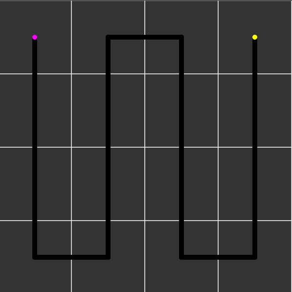

# Self Avoiding Walk

I am interested in how the self-avoiding walk works. Just like playing a snake game. From my research, I learned that the hamiltonian path(a path that travels all grids and never from a cycle) is self-avoiding and it also traverses all grids. For example, a 4x4 grid hamiltonian path starts at (0,0) and ends at (4,4). There are 52 ways to make a hamiltonian path on a 4x4 grid. It is easy to make a self-avoiding path in this situation. 

I wrote a p5 sketch that does this. The start point is the purple one and the yellow point is the endpoint. 



## Random Walk with Self Avoiding Path
Now the fun part is that the path I made in p5 is trivial even though it satisfies the characteristics of SAP.  
### Brute Force Solution
It is obvious to use brute force solution to construct a self-avoiding path. All I have to do is to check the pixels/grids from my current points. The algorithm in my head is something like this:
```
check current postion form a n/4 * n/4 grid as blocks to check
find a new grid that current point has not visited
if grid foundd 
visit that grid.
else no grid avaliable
increse block size and repeat
```
This solution's run time will be super long and most importantly the path will be stuck at someplace thus all grids will not guarantee to be visited. 

### Backbite Algorithm

The algorithm I learned is backbite algorithm. This [post](https://datagenetics.com/blog/december22018/index.html) did a good job to describe the backbite algorithm from this [paper](https://arxiv.org/abs/cond-mat/0508094).

I am still developing the backbite algorithm. This will add randomness into my original path but the result is still a self-avoiding path aka the hamiltonian path.

After taking sometime understanding the algorithm and writting code. I had the fully working code to generate random path with self avoiding walk. Here are some paths I generated. This algorithm add randomness to the path I originally genreated. SAW achieved. 
Here is the link of SAW p5 [sketch]()


Here is the link of SAW p5 (sketch)[]