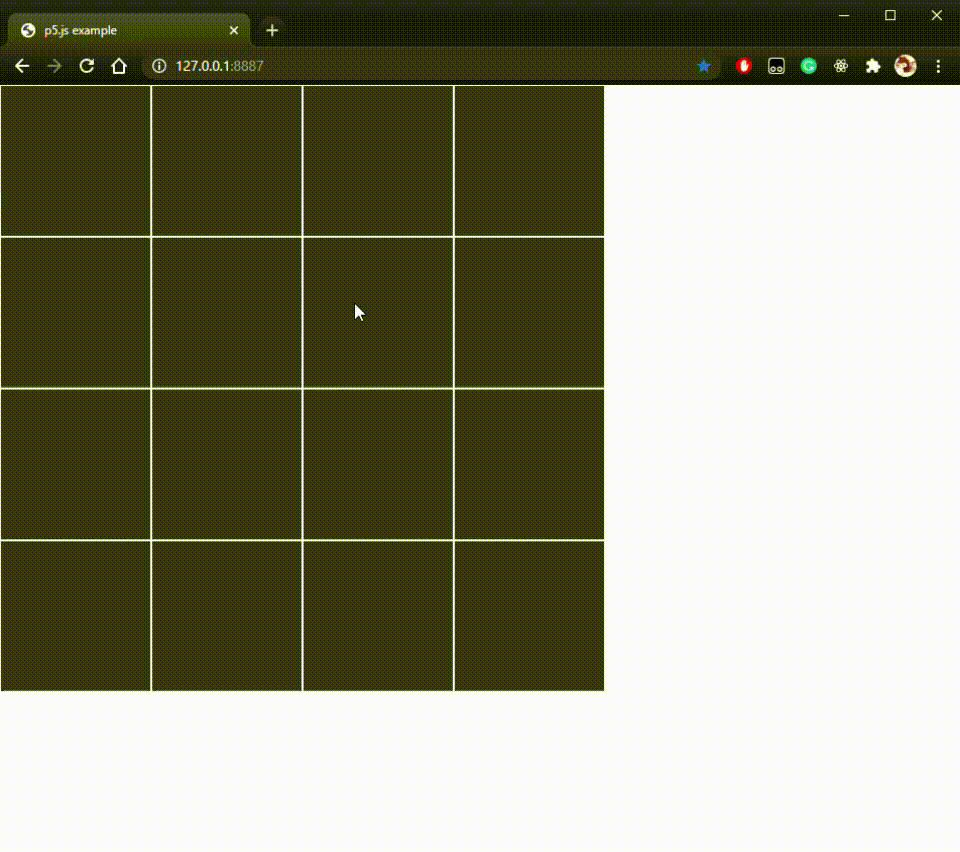

# Animation Using P5 Vectors

After implement self avoiding walk, I think my path should have some animations. P5 vectors have the ability to store all points as vectors and making animations. I didn't use anything complicated just some colored lines but using vectors as path points. 

Idealy, I could use vector.sub() to draw the new vector as line between them but I think it's more complicated than just use line function. Here is the SAW animation I made:

[p5 code](https://editor.p5js.org/yzhang33/sketches/yenNjRKTD)
 