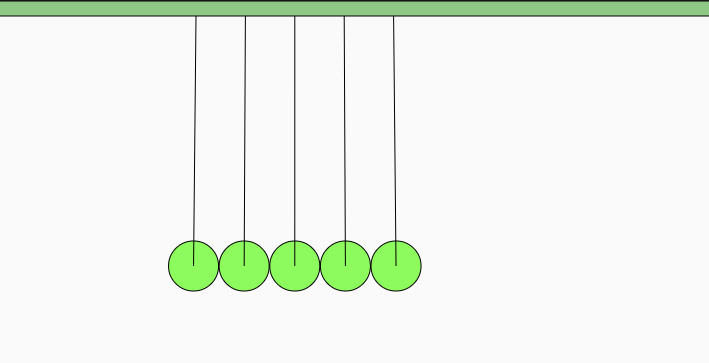

# Newton's Cradle

I remembered when I was young I used to play with this toy and just watch it for a while. I don't know the physics behind it until high school ---  conservation of momentum and the conservation of energy. I could built a virtual newton's cradle and play around with it since I lost the one I had before.

## Pendulum and Matter.js

As I exploring the internet, I found [matter.js](https://github.com/liabru/matter-js) is a very helpful library to play around with 2D physics. It even has a function called newton's cradle which I could use. I made my code into an object oriented fashion so that I could reuse the class to create other pendulums. The class will create a newton's cradle and add graphics into p5. It also updates the pendulum's positions. It took me sometimes to understand the whole structure of matter.js and who to add objects and use objects. 

I also added another feature which user can use mouse to drag pendulums and let it collide with others but sometime it went crazy if I drag it too high. It works like real newton's cradle but everything is in 2D instead of 3D.

[p5 sketch](https://editor.p5js.org/yzhang33/sketches/qRfN8JVDg)