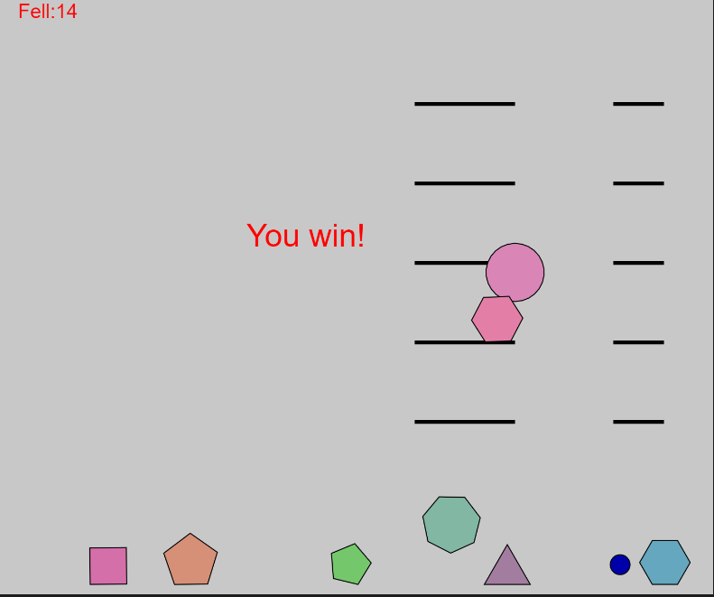

# Shots
I found matter.js is a great library and very useful. Most of the concepts I learned from Nature of Code already exist in matter.js. So I continue the exploration of matter.js this week and the objective to create a slingshot game in which players shoot down polygons from the shelf and get a score. 
[p5 link](https://editor.p5js.org/yzhang33/sketches/gO3pm-t2-)

## Polygon Class
* constructor:
The constructor initialized a random shaped polygon and add it to the world object of matter.js. Also initialized a shelf rectangle to hold polygons.
* show(): display polygon and its shelf.
* calDist(): calcuate distance between shelf and polygons return true if polygon fell from the current shelf
## Ball Class

* constructor: create a circle object and sling object and add to the world object. 
* show(): display circle and sling
* fire(): fire the ball if player draged it using mouse
* loadBall(): reload circle if ball fired
## Sketch.js
This class setting up the world of matter.js and its physics engine. Also a game score system to keept track of player's score. It also initialize poly class and ball class. 
Press any key to reload the sling shot.  
## Thoughts
Matter.js is a little bit tricky to use. I have to follow its syntax on object initialization. It also has benefits such as clicking and dragging. I tried to use the events but it not working well. I should look into it more. Some polygon will fall from the shelf when initialized and if I am a cheater, all polygons can be dragged down. I should also add the level system and disable cheating on my game :).
